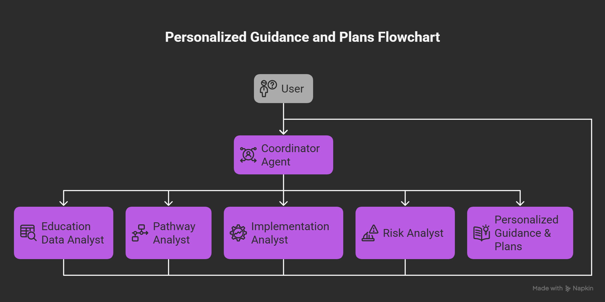
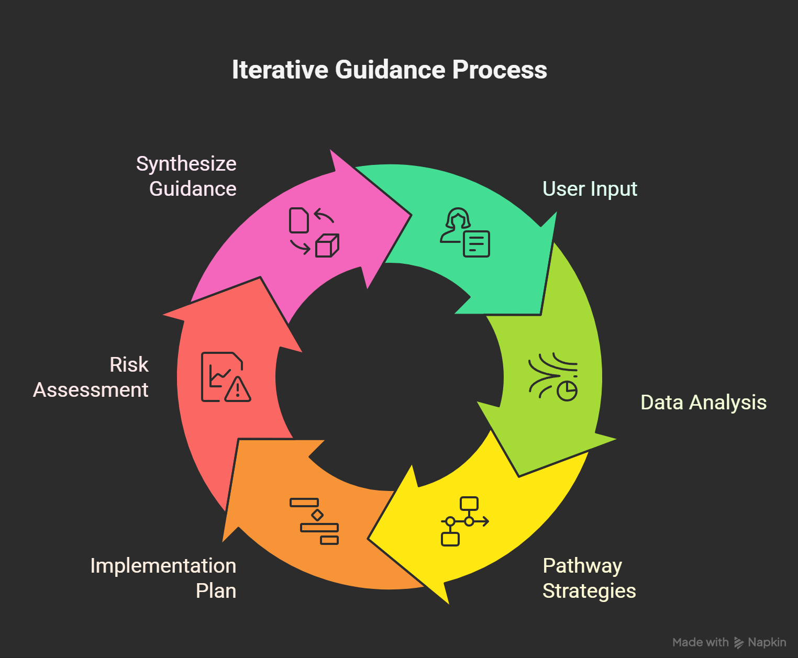

# 🎓 Education Path Advisor for India

> **Empowering Indian students and parents to make smarter education and career decisions!**

---

## 🚦 What is this?

**Education Path Advisor** is your AI-powered guide to India's complex education system. Whether you're a student, parent, or counselor, this tool helps you:

- Discover the best entrance exams and colleges for your goals
- Get step-by-step plans for exam prep, applications, and documentation
- Understand reservation policies and state-specific requirements
- Assess risks and always have a backup plan

No more confusion—just clear, actionable advice tailored to your unique situation!

---

## 🗺️ System Architecture (Mermaid Diagram)



---

## 🧩 Agent Workflow (Mermaid Sequence Diagram)



---

## ✨ Why You'll Love It

- **Personalized Pathways:** Get recommendations based on your interests, reservation category, and region
- **All Major Exams Covered:** JEE, NEET, CUET, state CETs, and more
- **Stepwise Action Plans:** Never miss a deadline or document
- **Risk & Backup Analysis:** Know your options if things don't go as planned
- **Privacy First:** No personal data stored—your queries are safe

---

## 🧠 How It Works

The system is powered by a team of specialized AI agents:

- **Education Data Analyst:** Finds the latest info on exams, colleges, and policies
- **Pathway Analyst:** Maps your profile to the best-fit education and career routes
- **Implementation Analyst:** Breaks down every step—prep, apply, document, succeed
- **Risk Analyst:** Flags risks and suggests backup plans
- **Coordinator:** Orchestrates everything for a seamless experience

All agent outputs are tracked using state keys for transparency and traceability.

---

## 🖥️ Example: See It in Action

**1. "I'm a 12th standard student interested in engineering. What are my options?"**

- Get a list of top exams (JEE Main, CETs), eligibility, reservation details, and college pathways (IITs, NITs, state colleges).

**2. "How do I prepare for NEET with a focus on OBC reservation?"**

- Receive a stepwise NEET prep plan, key dates, resources, and OBC documentation checklist.

**3. "Suggest a backup plan if I don't clear JEE Main."**

- Explore state exams, private universities, diploma-to-degree options, and risk/benefit analysis for each.

**4. "What documents do I need for admission under EWS quota?"**

- Get a clear list: EWS certificate, income proof, domicile, and tips for timely application.

**5. "Assess the risks if I take a gap year for exam preparation."**

- See academic, financial, and psychological risks, plus mitigation strategies and impact on future admissions.

---

## 🚀 Get Started in Minutes

1. **Install Prerequisites**
   - Python 3.11+
   - [Poetry](https://python-poetry.org/docs/):

     ```bash
     pip install poetry
     ```

   - Google Cloud Project & Google Cloud CLI ([Install Guide](https://cloud.google.com/sdk/docs/install))

2. **Clone & Install**

   ```bash
   git clone <this-repo-url>
   cd education-path-advisor
   poetry install
   ```

3. **Configure Environment**
   - Rename `.env.example` to `.env` and fill in your Google API key:

     ```bash
     GOOGLE_API_KEY=<your-google-api-key>
     GOOGLE_GENAI_USE_VERTEXAI=FALSE
     ```

4. **Run the Agent**
   - CLI:

     ```bash
     poetry run adk run education_path_advisor
     ```

   - Web UI:

     ```bash
     poetry run adk web
     ```

---

## 🧪 Test Your Setup

Install dev dependencies:

```bash
poetry install --with dev
```

Run tests:

```bash
python3 -m pytest tests
```

---

## 📁 Project Structure

- `education_advisor/` — Main agent and sub-agents (data, pathway, implementation, risk)
- `eval/`, `tests/` — Evaluation and test scripts

---

## ⚠️ Disclaimer

All recommendations, plans, and outputs generated by this project are for educational and informational purposes only. They do not constitute legal, financial, or professional advice. Users should consult relevant authorities or professionals before making any decisions based on these outputs.
