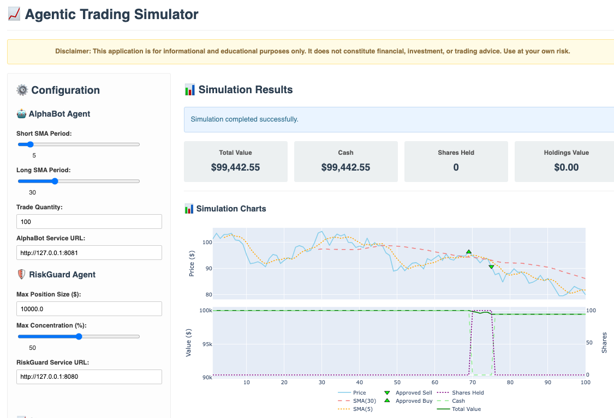
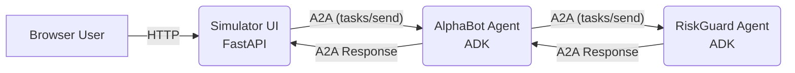

# 📈 Agentic Trading Simulator

> **Credits**: [kweinmeister](https://github.com/kweinmeister)

[](https://www.python.org/)
[](https://github.com/google/adk-python)
[](LICENSE)

This project demonstrates an agent-based trading system simulation featuring distinct agents for trading logic and risk management, communicating via the Agent-to-Agent (A2A) protocol. It includes a web-based simulator UI to configure, run, and visualize trading strategy performance.

**Disclaimer:** ⚠️ This application is intended for **educational and demonstration purposes only**. It does not constitute financial, investment, legal, or trading advice. Trading involves significant risk, and you could lose your entire investment. **Do not use this application for actual trading decisions or with real money.** Use at your own risk.



## Features

* **Modular Agent Architecture:** Separates concerns into distinct services:
  * **AlphaBot:** Implements a trading strategy (Simple Moving Average - [SMA crossover](https://en.wikipedia.org/wiki/Moving_average_crossover)) and proposes trades. Built using the [Google Agent Development Kit (ADK)](https://google.github.io/adk-docs/).
  * **RiskGuard:** Evaluates trade proposals from AlphaBot against configurable risk rules (max position size, max portfolio concentration). Also built using ADK.
  * **Simulator UI:** A [FastAPI](https://fastapi.tiangolo.com/)-based web application to configure simulation parameters, run the simulation, and visualize results using [Plotly](https://plotly.com/python/).
* **Agent-to-Agent (A2A) Communication:** Leverages the open [A2A protocol](https://github.com/google/A2A) for standardized, interoperable communication between the AlphaBot and RiskGuard agents. This allows agents built with different frameworks (like ADK in this case) to discover capabilities and interact securely.
* **Configurable Simulation:** Adjust parameters for market conditions (initial price, volatility, trend), trading strategy (SMA periods, trade quantity), and risk rules.
* **Portfolio Tracking:** Simulates portfolio changes (cash, shares, total value) based on executed trades.
* **Visualization:** Displays simulation results, including price action, SMA indicators, portfolio value, and trade execution markers on interactive charts.
* **Local & Cloud Deployment:** Includes scripts for easy local execution and deployment to [Google Cloud Run](https://cloud.google.com/run/docs).
* **Containerized Services:** Dockerfiles provided for building container images for each service, facilitated by [Google Cloud Build](https://cloud.google.com/build/docs).

## Architecture

The system consists of three main services interacting via HTTP and the A2A protocol:

1. **Simulator UI (FastAPI):**
    * Serves the web interface to the user.
    * Takes simulation parameters from the user.
    * Runs the market simulation loop.
    * For each step, it calls the **AlphaBot** service (A2A `tasks/send`) with current market data and portfolio state.
    * Receives trade decisions (approved/rejected trades or status updates) back from AlphaBot.
    * Updates the portfolio state based on executed trades.
    * Visualizes the results.

2. **AlphaBot (ADK/Python):**
    * Receives A2A requests from the Simulator.
    * Analyzes market data (calculates SMAs) to determine a potential trade signal (BUY/SELL).
    * If a trade is proposed, it calls the **RiskGuard** service (A2A `tasks/send` via `a2a_risk_tool.py`) with the trade proposal and portfolio state.
    * Receives the risk assessment result (approved/rejected) from RiskGuard.
    * Updates its internal state (`_should_be_long`).
    * Returns the final trade decision (including risk assessment outcome) back to the Simulator via an A2A response, potentially using artifacts.

3. **RiskGuard (ADK/Python):**
    * Receives A2A requests from AlphaBot containing a trade proposal and portfolio state.
    * Evaluates the proposal against configured risk rules (`rules.py`).
    * Returns the risk assessment result (approved/rejected with reason) back to AlphaBot via an A2A response, typically within an artifact.



### A2A Protocol in Action

This project utilizes the A2A protocol for the critical communication link between the trading logic (AlphaBot) and the risk assessment logic (RiskGuard). Here's how it applies the core A2A concepts:

* **A2A Server:** Both AlphaBot and RiskGuard act as A2A Servers, exposing HTTP endpoints defined by the A2A specification.
* **A2A Client:**
  * The Simulator UI acts as a client when initiating a task with AlphaBot (`tasks/send`).
  * AlphaBot acts as a client when sending a trade proposal task to RiskGuard (`tasks/send`).
* **Task:** The primary unit of work.
  * The Simulator sends a task to AlphaBot containing market/portfolio data.
  * AlphaBot sends a sub-task to RiskGuard containing the proposed trade details.
* **Message/Part:** Data like market state, portfolio details, and trade proposals are exchanged within A2A Messages using appropriate Parts (likely `DataPart` for structured JSON).
* **Artifact:** RiskGuard returns its assessment (approved/rejected with reason) as an Artifact within the A2A response to AlphaBot. AlphaBot may also use artifacts to return structured results to the Simulator.
* **Agent Card:** While not explicitly fetched dynamically in this simplified local setup, in a real-world scenario, AlphaBot could discover RiskGuard's capabilities and endpoint URL by fetching its `agent.json` file (Agent Card). The ADK framework handles much of the underlying A2A protocol implementation details.

This demonstrates how A2A enables modularity, allowing specialized agents to collaborate effectively.

## 🚀 Getting Started

### Prerequisites

* [Python](https://www.python.org/downloads/) (Version 3.11+ required)
* [Git](https://git-scm.com/) for cloning the repository
* [Google Cloud SDK (`gcloud`)](https://cloud.google.com/sdk/docs/install) (Optional - for Cloud Run deployment)

### Option 1: Automated Setup (Recommended)

**For Windows Users:**

```powershell
# Run setup and start services
.\setup.ps1
.\deploy_local.ps1
# Open browser to http://127.0.0.1:8000
```

**For Linux/Mac Users:**

```bash
# Create virtual environment and install dependencies  
python -m venv venv
source venv/bin/activate
pip install -r requirements.txt
./deploy_local.sh
# Open browser to http://127.0.0.1:8000
```

### Option 2: Manual Setup

1. **Clone and navigate:**

    ```bash
    git clone https://github.com/your-username/awesome-adk-agents
    cd awesome-adk-agents/examples/agentic-trading
    ```

2. **Create virtual environment:**

    ```bash
    python -m venv venv
    # Windows: venv\Scripts\activate
    # Linux/Mac: source venv/bin/activate
    ```

3. **Install and verify:**

    ```bash
    pip install --upgrade pip
    pip install -r requirements.txt
    python -c "import google.adk; import pandas; import fastapi; print('✅ All dependencies installed')"
    ```

### 🆘 Need Help?

* Check [TROUBLESHOOTING.md](./TROUBLESHOOTING.md) for common issues
* Windows users: Use PowerShell for best results
* Port conflicts: Run `.\stop_local.ps1` (Windows) to stop services

### Service Health Check

Once running, verify all services are working:

* **Simulator UI**: <http://127.0.0.1:8000> (Main application)
* **AlphaBot**: <http://127.0.0.1:8081/agent.json> (Agent metadata)
* **RiskGuard**: <http://127.0.0.1:8080/agent.json> (Agent metadata)

## Running Tests

Ensure development dependencies are installed:

```bash
pip install -r requirements-dev.txt
```

Run tests using pytest:

```bash
pytest tests/
```

## Cloud Deployment

### Google Cloud Run

Deploy all services to Cloud Run using the automated script:

```bash
./deploy_cloud_run.sh
```

**Prerequisites:**

1. Set your Google Cloud Project ID in the script or environment variable
2. Authenticate with `gcloud auth login`
3. Ensure you have permissions for Cloud Run, Cloud Build, and Artifact Registry

The script will build and deploy all services, then output the Simulator UI URL.

**⚠️ Security Note:** The public deployment makes services accessible to anyone on the internet. For production, implement proper authentication using [Google Cloud IAP](https://cloud.google.com/iap/docs).

## Configuration

* **Default Settings**: See `common/config.py` for SMA periods, risk limits, and service URLs
* **Environment Variables**: Service URLs are automatically configured during deployment
* **Port Configuration**: Uses standard `PORT` environment variable for Cloud Run compatibility

## Quick Reference

| Action | Windows | Linux/Mac |
|--------|---------|-----------|
| Setup Environment | `.\setup.ps1` | `./setup.sh` |
| Start Services | `.\deploy_local.ps1` | `./deploy_local.sh` |
| Stop Services | `.\stop_local.ps1` | `Ctrl+C` |
| Validate Setup | `.\validate_setup.ps1` | Manual check |
| View Logs | Check PowerShell output | Check terminal output |

**Default URLs:**

* Simulator UI: <http://127.0.0.1:8000>
* AlphaBot: <http://127.0.0.1:8081>
* RiskGuard: <http://127.0.0.1:8080>

For additional help, see [TROUBLESHOOTING.md](./TROUBLESHOOTING.md) and [PROJECT_STRUCTURE.md](./PROJECT_STRUCTURE.md).
