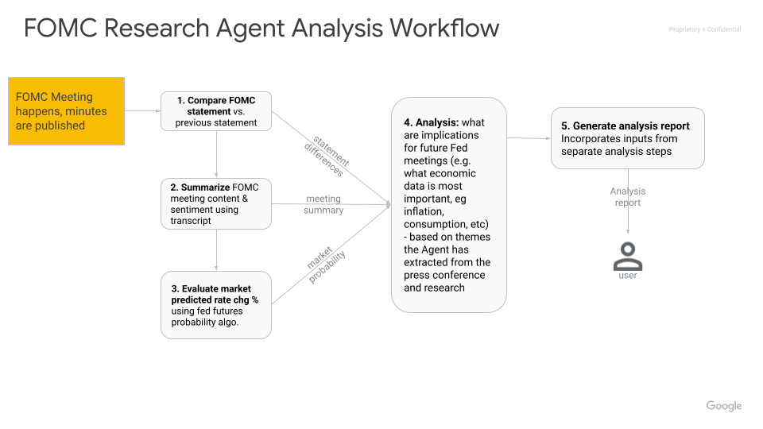

# 🏛️ FOMC Research Agent

## Overview

The FOMC Research Agent is a sophisticated multi-agent system designed to automate the generation of comprehensive research reports on Federal Open Market Committee (FOMC) meetings. It provides deep insights into monetary policy decisions, leveraging data from official Federal Reserve sources and financial markets. This agent is particularly useful for financial institutions, analysts, and traders who require rapid and thorough analysis of Fed policy decisions.

The Federal Open Market Committee (FOMC) plays a crucial role in setting U.S. interest rate policy, making its statements highly influential in global financial markets.

### Agent Workflow

The agent follows a structured workflow to generate its analysis:

1. Retrieves FOMC meeting data (statements, press releases).
2. Integrates market data for a comprehensive view.
3. Analyzes the collected information using specialized sub-agents.
4. Generates a detailed report on the FOMC meeting and its market impact.



*Note: Press conference video analysis (step 3 in the diagram) is a feature currently under development.*

## Agent Details

| Feature              | Description                                                                                                |
| -------------------- | ---------------------------------------------------------------------------------------------------------- |
| **Interaction Type** | Workflow (Primarily non-conversational, focused on autonomous report generation)                           |
| **Complexity**       | Advanced                                                                                                   |
| **Agent Type**       | Multi-Agent System                                                                                         |
| **Components**       | Live Web Access, Database Integration (BigQuery), Multi-modal Analysis (text, potential for video), Report Generation |
| **Vertical**         | Financial Services                                                                                         |
| **Framework**        | Google Agent Development Kit (ADK)                                                                         |

## Architecture

The FOMC Research Agent employs a multi-agent architecture where specialized sub-agents collaborate to produce the final analysis.


### Key Architectural Components

* **Root Agent (`root_agent`):** Serves as the entry point and orchestrator for the entire workflow, coordinating the activities of other specialized agents.
* **Research Agent (`research_agent`):** Manages the retrieval of individual research components necessary for the analysis.
* **Analysis Agent (`analysis_agent`):** Processes the information gathered by the `research_agent` to generate the final analytical report.
* **Data Retrieval Agents:**
  * `retrieve_meeting_data_agent`: Fetches FOMC meeting data from web sources.
  * `extract_page_data_agent`: Extracts specific data points from HTML content.
  * `summarize_meeting_agent`: Reads meeting transcripts and generates concise summaries.
* **Core Tools:**
  * `fetch_page_tool`: Handles HTTP requests for retrieving web page content.
  * `store_state_tool`: Manages state information within the ToolContext.
  * `analyze_video_tool`: (Future capability) Processes and analyzes video content (e.g., press conferences).
  * `compute_probability_tool`: Calculates the probability of interest rate changes based on Fed Futures pricing data.
  * `compare_statements_tool`: Compares current and previous FOMC statements to identify key changes.
  * `fetch_transcript_tool`: Retrieves FOMC meeting transcripts.
* **Callbacks:**
  * `rate_limit_callback`: Implements request rate limiting to prevent API overuse and errors like `429: Resource Exhausted`.

## Key Features

* **Autonomous Operation:** Designed for a largely non-conversational workflow, requiring minimal human intervention once initiated.
* **Multi-Agent Collaboration:** Utilizes specialized sub-agents that work in concert to deliver comprehensive and nuanced analysis.
* **Real-time Data Integration:** Leverages live web access to fetch data from official Federal Reserve sources and external financial databases.
* **Institutional-Quality Reporting:** Aims to produce detailed analytical reports comparable to those from professional financial research services.
* **Rapid Analysis:** Engineered for quick turnaround from the conclusion of an FOMC meeting to the delivery of a comprehensive report.
* **Market-Focused Insights:** Specifically tailored for financial market participants who depend on timely and accurate interpretations of Fed policy.

## Setup and Installation

### Prerequisites

1. **Google Cloud SDK and GCP Project:**
   * A Google Cloud Project is required for BigQuery setup and Agent Engine deployment.
   * Install the [Google Cloud SDK](https://cloud.google.com/sdk/docs/install).
   * Authenticate with your project:

     ```bash
     gcloud auth login
     ```

   * Enable necessary APIs:

     ```bash
     gcloud services enable aiplatform.googleapis.com
     gcloud services enable bigquery.googleapis.com
     ```

2. **Python and Poetry:**
   * Ensure you have Python installed.
   * Install [Poetry](https://python-poetry.org) for managing dependencies:

     ```bash
     pip install poetry
     ```

### Installation Steps

1. **Clone the Repository:**

   ```bash
   git clone https://github.com/google/adk-samples.git
   cd adk-samples/python/agents/fomc-research
   ```

2. **Install Dependencies:**
   Use Poetry to install the required packages, including the Google Agent Development Kit (`google-adk`):

   ```bash
   poetry install
   ```

### Configuration

1. **Environment Variables:**
   * Copy the `.env-example` file to `.env`.
   * Update the `.env` file with your project-specific values (e.g., `GOOGLE_CLOUD_PROJECT`, `GOOGLE_CLOUD_BQ_DATASET`, `GOOGLE_CLOUD_LOCATION`).
   * Export these variables into your shell environment. For `bash`:

     ```bash
     set -o allexport
     source .env
     set +o allexport
     ```

     (Adapt for other shells if necessary).

2. **BigQuery Setup:**
   * A BigQuery table containing Fed Futures pricing data is needed. A sample data file (`sample_timeseries_data.csv`) is provided for the FOMC meetings on Jan 29 and Mar 19, 2025. For other dates, you'll need to source additional data.
   * To load the sample data into BigQuery, navigate to the `fomc-research/deployment` directory and run:

     ```bash
     python bigquery_setup.py --project_id=$GOOGLE_CLOUD_PROJECT \
         --dataset_id=$GOOGLE_CLOUD_BQ_DATASET \
         --location=$GOOGLE_CLOUD_LOCATION \
         --data_file=sample_timeseries_data.csv
     ```

## Running the Agent

You can run the FOMC Research Agent using the ADK command-line interface or the ADK Dev UI.

### Using the ADK Command Line

1. Navigate to the `fomc-research` directory.
2. Execute the agent:

   ```bash
   adk run fomc_research
   ```

3. The agent will output a command to tail its log file, e.g.:

   ```bash
   tail -F /tmp/agents_log/agent.latest.log
   ```

### Using the ADK Dev UI

1. Navigate to the `fomc-research` directory.
2. Start the ADK web UI:

   ```bash
   adk web .
   ```

3. Open the displayed URL in your browser.
4. In the UI, select `fomc_research` from the dropdown to load the agent.
5. To save logs and tail them simultaneously:

   ```bash
   adk web . > fomc_research_log.txt 2>&1 &
   tail -f fomc_research_log.txt
   ```

### Example Interaction

1. Initiate the interaction:

   ```text
   user: Hello. What can you do for me?
   ```

   The agent will respond:

   ```text
   [root_agent]: I can help you analyze past Fed Open Market Committee (FOMC) meetings and provide you with a thorough analysis report. To start, please provide the date of the meeting you would like to analyze. If you have already provided it, please confirm the date. I need the date in ISO format (YYYY-MM-DD).
   ```

2. Provide the meeting date:

   ```text
   user: 2025-01-29
   ```

   The agent will then proceed with the analysis and generate a report:

   ```text
   [analysis_agent]: Here is a summary and analysis of the January 29, 2025 FOMC meeting, based on the available information:
   ... (report details) ...
   ```

*If the agent seems to pause during its workflow, a simple prompt like "continue" might be sufficient to resume its operation.*

## Deployment on Vertex AI Agent Engine

### Prerequisites for Deployment

1. **Set up GCP for Agent Engine:** Follow the [official documentation](https://cloud.google.com/vertex-ai/generative-ai/docs/agent-engine/set-up) to configure your Google Cloud project for Agent Engine.
2. **Grant Permissions:** The Reasoning Engine Service Agent needs BigQuery User and BigQuery Data Viewer roles.

   ```bash
   export RE_SA="service-${GOOGLE_CLOUD_PROJECT_NUMBER}@gcp-sa-aiplatform-re.iam.gserviceaccount.com"
   gcloud projects add-iam-policy-binding ${GOOGLE_CLOUD_PROJECT} \
       --member="serviceAccount:${RE_SA}" \
       --condition=None \
       --role="roles/bigquery.user"
   gcloud projects add-iam-policy-binding ${GOOGLE_CLOUD_PROJECT} \
       --member="serviceAccount:${RE_SA}" \
       --condition=None \
       --role="roles/bigquery.dataViewer"
   ```

### Deployment Steps

1. **Build the Agent Package:**
   Navigate to the `fomc-research` directory and build the wheel file:

   ```bash
   poetry build --format=wheel --output=deployment
   ```

   This creates `fomc_research-0.1-py3-none-any.whl` in the `deployment` directory.

2. **Deploy to Agent Engine:**
   Change to the `deployment` directory and run the deployment script:

   ```bash
   cd deployment
   python3 deploy.py --create
   ```

   Successful deployment will output an Agent Engine resource name (e.g., `projects/your-project/locations/us-central1/reasoningEngines/your-resource-id`). Note the resource ID.

### Testing the Deployed Agent

1. **Set Environment Variables:**

   ```bash
   export RESOURCE_ID=<your-agent-engine-resource-id>
   export USER_ID=<any-string-for-user-identification>
   ```

2. **Run the Test Script:**
   In the `deployment` directory:

   ```bash
   python test_deployment.py --resource_id=$RESOURCE_ID --user_id=$USER_ID
   ```

   An example interaction:

   ```text
   Input: Hello. What can you do for me?
   Response: I can create an analysis report on FOMC meetings. To start, please provide the date of the meeting you want to analyze. I need the date in YYYY-MM-DD format.

   Input: 2025-01-29
   Response: I have stored the date you provided. Now I will retrieve the meeting data.
   ...
   ```

   The `test_deploy.py` script demonstrates basic interaction with the deployed agent using the Agent Engine API.

### Deleting the Agent Deployment

To remove the agent from Agent Engine:

```bash
python3 deployment/deploy.py --delete --resource_id=$RESOURCE_ID
```

## Troubleshooting

* **"Malformed function call" Error:** This is an occasional error from the underlying Gemini model. Restarting the UI or the agent run usually resolves it. Future model versions are expected to address this.
* **Agent Stops Mid-Workflow:** If the agent pauses, try prompting it to "continue" or providing a similar instruction to resume its operation.

## Disclaimer

This agent sample is provided for illustrative purposes only and is not intended for production use. It serves as a basic example of an agent and a foundational starting point for individuals or teams to develop their own agents.

This sample has not been rigorously tested, may contain bugs or limitations, and does not include features or optimizations typically required for a production environment (e.g., robust error handling, security measures, scalability, performance considerations, comprehensive logging, or advanced configuration options).

Users are solely responsible for any further development, testing, security hardening, and deployment of agents based on this sample. We recommend thorough review, testing, and the implementation of appropriate safeguards before using any derived agent in a live or critical system.