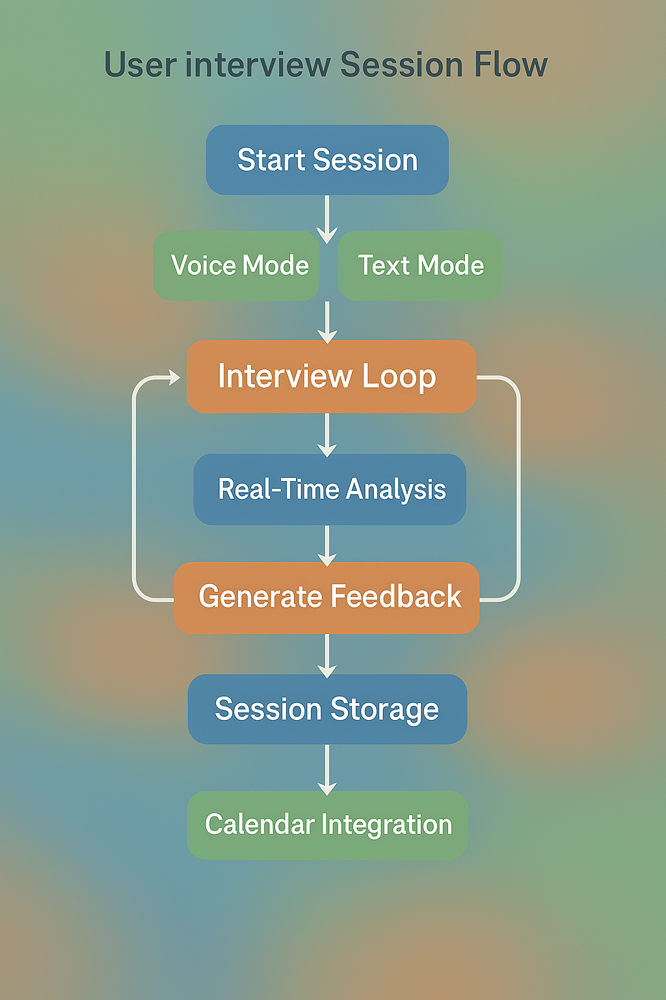
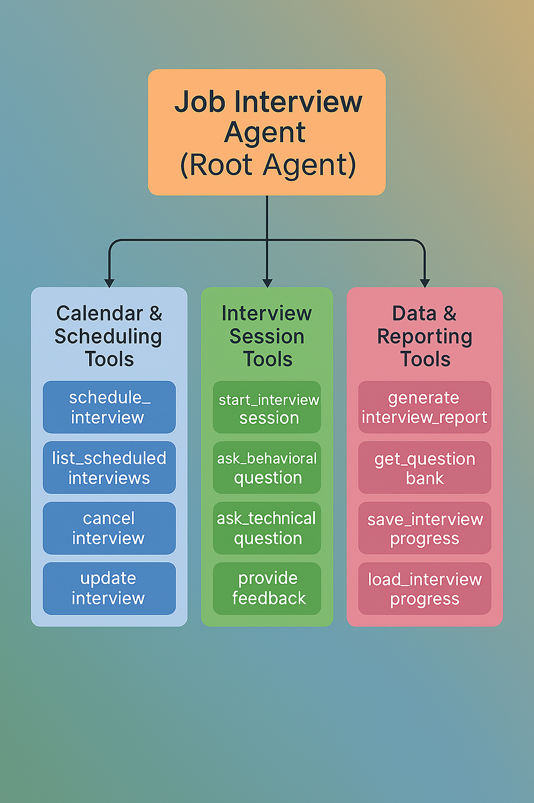
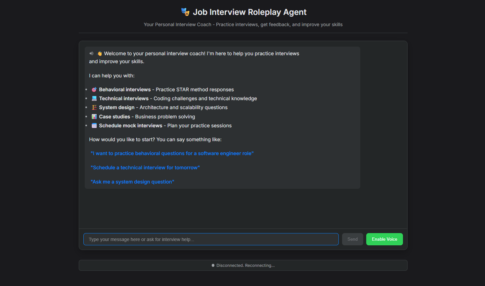

# Job Interview Roleplay Agent 🎯

The AI-powered interview coaching platform built with Google's Agent Development Kit (ADK). Experience realistic job interviews with **natural voice conversations**, intelligent feedback, and comprehensive progress tracking across all interview formats and career levels.

## 🚀 Key Features & Capabilities

### 🎙️ Advanced Voice & Audio Technology

- **Real-time Voice Conversations**: WebSocket-powered streaming with crystal-clear audio
- **Intelligent Speech Recognition**: Advanced transcription with natural language processing
- **Dynamic Voice Personas**: Multiple interviewer voices (HR, Technical Lead, CEO, etc.)
- **Conversation Flow Control**: Natural interruption handling and turn-taking
- **Multi-modal Communication**: Seamless switching between voice and text modes
- **Audio Quality Optimization**: Noise reduction and clarity enhancement
- **Voice Feedback Analysis**: Tone, pace, and confidence assessment

### 🎭 Comprehensive Interview Simulation

#### Interview Types & Formats

- **Behavioral Interviews**: STAR method coaching with deep situational analysis
- **Technical Interviews**: Live coding challenges, algorithm discussions, debugging scenarios
- **System Design**: Architecture discussions, scalability planning, trade-off analysis
- **Case Studies**: Business problem solving, analytical thinking assessment
- **Panel Interviews**: Multi-interviewer scenarios with role-playing
- **Phone/Video Screening**: Realistic remote interview simulation
- **Whiteboard Coding**: Visual problem-solving with real-time collaboration

#### Industry-Specific Scenarios

- **Software Engineering**: Full-stack, frontend, backend, DevOps, mobile development
- **Data Science**: Statistical analysis, ML modeling, data interpretation
- **Product Management**: Strategy, roadmapping, stakeholder management
- **Sales & Marketing**: Pitch presentations, objection handling, customer scenarios
- **Consulting**: Case interviews, problem structuring, client communication
- **Finance**: Risk analysis, modeling, market knowledge assessment
- **Healthcare**: Clinical scenarios, compliance, patient interaction

### 🎨 Custom Modern UI & UX

#### Dark Theme Interface

- **Sleek Modern Design**: Professional dark theme with subtle gradients
- **Responsive Layout**: Optimized for desktop, tablet, and mobile devices
- **Interactive Voice Controls**: One-click voice activation with visual feedback
- **Real-time Status Display**: Live connection, recording, and processing indicators
- **Message Threading**: Clear conversation history with time stamps
- **Accessibility Features**: Screen reader support, keyboard navigation, high contrast options

#### Advanced UI Components

- **Voice Visualizer**: Real-time audio waveform display during conversations
- **Progress Indicators**: Session completion, skill improvement tracking
- **Interactive Scoring**: Live feedback display with detailed breakdowns
- **Session Management**: Easy start/stop/pause controls with session persistence
- **Multi-session Support**: Concurrent interview sessions for different roles
- **Export Features**: Interview transcripts, feedback reports, progress summaries

### 🧠 Intelligent AI Features

#### Adaptive Learning System

- **Experience Level Detection**: Automatically adjusts difficulty based on responses
- **Learning Pattern Recognition**: Identifies strengths and improvement areas
- **Personalized Question Banks**: Custom question generation based on background
- **Progressive Difficulty**: Gradual complexity increase as skills improve
- **Context-Aware Follow-ups**: Intelligent probing questions based on initial responses

#### Smart Feedback Engine

- **Real-time Performance Analysis**: Instant feedback during conversations
- **Multi-dimensional Scoring**: Technical skills, communication, problem-solving assessment
- **Detailed Improvement Suggestions**: Specific actionable recommendations
- **Comparative Analysis**: Performance benchmarking against industry standards
- **Growth Tracking**: Long-term skill development monitoring

### 📅 Advanced Calendar & Scheduling Integration

#### Google Calendar Sync

- **Seamless Scheduling**: Direct calendar integration for interview appointments
- **Smart Reminders**: Automated prep notifications and session alerts
- **Availability Management**: Intelligent scheduling based on free time
- **Recurring Sessions**: Automated weekly/monthly practice scheduling
- **Time Zone Support**: Global scheduling with automatic time conversion
- **Meeting Preparation**: Pre-session briefings and focus area recommendations

#### Session Management

- **Interview History**: Complete record of all practice sessions
- **Performance Analytics**: Detailed progress reports and trend analysis
- **Goal Setting**: Personalized improvement targets and milestones
- **Achievement Tracking**: Skill badges, completion certificates, progress rewards

### 🔧 Extensive Customization Options

#### Custom Question Banks

- **Role-specific Libraries**: Curated questions for 50+ job roles
- **Industry Standards**: Questions aligned with FAANG, startup, enterprise practices
- **Difficulty Scaling**: Beginner, intermediate, expert level questions
- **Custom Question Creation**: Build your own question sets and scenarios
- **Community Questions**: Access to crowd-sourced interview experiences
- **Dynamic Question Generation**: AI-powered question creation based on job descriptions

#### Flexible Configuration

- **Interview Duration Control**: 15-minute quick practice to 2-hour comprehensive sessions
- **Focus Area Selection**: Target specific skills and competencies
- **Scoring Criteria Customization**: Adjust evaluation parameters to match company standards
- **Persona Customization**: Create custom interviewer personalities and styles
- **Language Support**: Multi-language interview practice capabilities
- **Regional Variations**: Location-specific interview styles and cultural considerations

### 📊 Advanced Analytics & Reporting

#### Performance Metrics

- **Skill Progression Tracking**: Detailed improvement charts across multiple dimensions
- **Response Quality Analysis**: Content depth, structure, and relevance scoring
- **Communication Assessment**: Clarity, confidence, and engagement metrics
- **Time Management**: Response pacing and interview timing optimization
- **Stress Level Monitoring**: Voice analysis for anxiety and confidence detection

#### Comprehensive Reports

- **Session Summaries**: Detailed breakdown of each interview session
- **Progress Dashboards**: Visual representation of skill development over time
- **Benchmarking**: Performance comparison with industry standards and peer groups
- **Improvement Roadmaps**: Personalized learning paths and recommended practice areas
- **Interview Readiness Score**: Overall assessment with specific action items

### 🔄 Multi-Agent Interview Scenarios

#### Panel Interview Simulation

- **Multiple Interviewer Personas**: HR, Technical Lead, Team Member, Hiring Manager
- **Dynamic Role Switching**: Seamless transition between different interviewer styles
- **Realistic Group Dynamics**: Interruptions, follow-up questions, and collaborative assessment
- **Cross-functional Questions**: Questions spanning technical, behavioral, and cultural fit

#### Interview Process Simulation

- **End-to-End Experience**: From initial screening to final round interviews
- **Progressive Difficulty**: Each round adapts based on previous performance
- **Realistic Timing**: Authentic interview duration and pacing
- **Between-Round Feedback**: Guidance for improvement between interview stages

## 🎯 Supported Interview Formats

### 🤝 Behavioral Interviews

- **STAR Method Coaching**: Situation, Task, Action, Result framework training
- **Leadership Scenarios**: Team management, conflict resolution, decision-making
- **Problem-Solving Stories**: Complex challenges and innovative solutions
- **Cultural Fit Assessment**: Values alignment and team dynamics
- **Career Journey Exploration**: Background, motivations, and future goals

### 💻 Technical Interviews

- **Live Coding Challenges**: Real-time programming with multiple language support
- **Algorithm & Data Structures**: Comprehensive coverage of CS fundamentals
- **System Design Deep Dives**: Scalability, architecture, and trade-off discussions
- **Debugging Scenarios**: Code review and error identification exercises
- **Technology Discussions**: Framework knowledge, best practices, and industry trends

### 📈 Case Study Interviews

- **Business Strategy Cases**: Market analysis, competitive positioning, growth strategies
- **Product Development**: Feature prioritization, user research, roadmap planning
- **Financial Analysis**: Revenue modeling, cost optimization, investment decisions
- **Operations Optimization**: Process improvement, efficiency gains, resource allocation

### 🎪 Specialized Formats

- **Presentation Interviews**: Public speaking practice with Q&A sessions
- **Portfolio Reviews**: Creative work discussion and critique sessions
- **Technical Assessments**: Take-home project simulation and review
- **Culture Interviews**: Value-based discussions and team fit evaluation

## How It Works

The following diagram illustrates the comprehensive workflow of the Job Interview Agent:




## 🚀 Quick Start Guide

### Prerequisites

- Python 3.8 or newer
- Microphone and speakers for voice interaction
- Google account (for Calendar integration - optional)

### 1. Setup Project

```bash
# Navigate to the job interview agent directory
cd job-interview-agent

# Create virtual environment
python -m venv .venv

# Activate virtual environment
.venv\Scripts\activate          # Windows
source .venv/bin/activate       # macOS/Linux

# Install dependencies
pip install -r requirements.txt
```

### 2. Setup Gemini API Key

1. Create or use an existing [Google AI Studio](https://aistudio.google.com/) account
2. Get your Gemini API key from the [API Keys section](https://aistudio.google.com/app/apikeys)
3. Create a `.env` file in the project root:

```bash
GOOGLE_API_KEY=your_gemini_api_key_here
```

### 3. Setup Google Calendar Integration (Optional)

#### Create Google Cloud Project

1. Go to the [Google Cloud Console](https://console.cloud.google.com/)
2. Create a new project or select an existing one
3. Enable the Google Calendar API:
   - Navigate to "APIs & Services" > "Library"
   - Search for "Google Calendar API" and enable it

#### Create OAuth 2.0 Credentials

1. In Google Cloud Console, go to "APIs & Services" > "Credentials"
2. Click "Create Credentials" > "OAuth client ID"
3. Select "Desktop application" as application type
4. Name it "Job Interview Agent Calendar"
5. Download the credentials JSON file
6. Save as `credentials.json` in the project root

#### Run Calendar Setup

```bash
# Authenticate with Google Calendar
python setup_calendar_auth.py
```

This will:

- Open your browser for OAuth authorization
- Save access token securely
- Test calendar connection
- Grant access to schedule interview practice sessions

### 4. Start the Agent

```bash
# Navigate to app directory
cd app

# Start the server
python main.py

# Start hot-reloading server
uvicorn main:app --reload --host
```

### 5. Start Practicing 🎙️



Open your browser and go to: **<http://localhost:8000>**

#### Voice Mode Quick Start

Click the microphone icon and say:
> **"Hi, I'd like to practice for a software engineer interview"**

#### Calendar Integration

Try calendar commands:
> **"Schedule a practice interview for tomorrow at 3 PM"**

#### Advanced Features
>
> **"Start a technical interview with system design focus for a senior role"**

That's it! You're now ready for comprehensive voice-powered interview practice with full scheduling and analytics.

## 🎙️ Voice Interview Examples

### 🎯 Advanced Product Manager Interview

```text
You: "Hi, I'd like to practice behavioral questions for a product manager role at a tech company"

Agent: "Excellent! I'll simulate a senior PM interview. Let's start with strategic thinking. 
        Imagine you're leading a product that's losing market share. Walk me through your 
        approach to diagnose the problem and develop a turnaround strategy."

You: "First, I'd analyze our user retention metrics and competitor landscape..."

Agent: [Real-time feedback] "Strong analytical start! I can hear confidence in your voice. 
        Can you be more specific about which metrics you'd prioritize and why? Also, 
        how would you balance short-term fixes with long-term strategy?"

You: "I'd focus on daily active users and feature adoption rates because..."

Agent: "Excellent deep-dive! Your communication is clear and structured. Let me challenge 
        you further - how would you present this to the C-suite with conflicting priorities?"
```

### 💻 Senior Software Engineer Technical Deep-Dive

```text
You: "I'm preparing for a senior engineer role. Can you give me a system design challenge?"

Agent: "Perfect! Let's design a real-time chat system like WhatsApp that supports 
        1 billion users. Start with the high-level architecture."

You: "I'd begin with a microservices architecture with separate services for..."

Agent: [Live coding simulation] "Great foundation! I see you're thinking about scalability. 
        Can you walk me through how you'd handle message ordering across distributed systems? 
        Also, draw out the database schema on your whiteboard."

You: "For message ordering, I'd use vector clocks or timestamp-based approaches..."

Agent: "Impressive! Your technical depth is solid. Now, let's discuss trade-offs. 
        How would you handle the CAP theorem constraints in this system?"
```

### 🎨 Creative Portfolio Review Session

```text
You: "I need help preparing for a UX designer interview with portfolio presentation"

Agent: "Excellent! I'll play the role of a design director. Please present your 
        strongest case study and walk me through your design process."

You: "This project involved redesigning a healthcare app to improve patient engagement..."

Agent: [Visual analysis mode] "I can see your design thinking process. Your user research 
        is thorough. Tell me about a time when user feedback completely changed your approach. 
        How did you validate the new direction?"

You: "Actually, in week 3 of testing, we discovered that older users were struggling..."

Agent: "That's exactly what I wanted to hear - adaptability! How did you communicate 
        this pivot to stakeholders who were already invested in the original direction?"
```

### 🔬 Data Scientist Technical + Behavioral Combo

```text
You: "I want to practice a comprehensive data science interview with both technical and behavioral parts"

Agent: "Perfect! I'll simulate a full-round interview. Let's start technical: You have a 
        dataset with 30% missing values. Walk me through your approach to handling this."

You: "I'd first analyze the missingness pattern using visualization techniques..."

Agent: "Solid approach! Now, code this up. Explain your thought process as you write."

[After coding session]

Agent: "Great technical execution! Now let's shift to behavioral. Tell me about a time 
        when your analysis revealed something unexpected that changed business strategy."

You: "In my previous role, I discovered that our churn prediction model was biased..."

Agent: "Fascinating! How did you communicate these complex findings to non-technical executives?"
```

### 🏢 Executive Leadership Assessment

```text
You: "I'm interviewing for a VP of Engineering role. Can you simulate a C-level interview?"

Agent: [Executive presence mode] "Welcome! I'm the CEO. We're scaling from 50 to 500 engineers 
        in 18 months. How do you build engineering culture while maintaining velocity?"

You: "Culture scaling is critical. I'd focus on three pillars: hiring standards, 
        mentorship programs, and cross-team collaboration frameworks..."

Agent: "I appreciate the structured thinking. We've had friction between product and 
        engineering. How would you personally resolve this tension while reporting to me?"

You: "I'd start by establishing shared success metrics and regular alignment sessions..."

Agent: "Good diplomatic approach. But what if the CPO pushes back aggressively? 
        Give me a specific scenario of how you'd handle conflict at the executive level."
```

### 🚀 Startup Founder Pitch Practice

```text
You: "I need to practice pitching my startup idea to potential co-founders"

Agent: "Interesting! I'll play a technical co-founder candidate. I'm skeptical but 
        talented. Convince me to join your journey."

You: "We're building an AI-powered platform that revolutionizes how small businesses..."

Agent: [Skeptical founder mode] "I've heard 'AI-powered' a thousand times. What's your 
        actual defensible moat? And why can't Google or Microsoft just copy this?"

You: "Our unfair advantage is in the specialized domain knowledge and our unique data..."

Agent: "Okay, you've got my attention. But I'm giving up a $300K salary. What's my 
        equity package and what happens if this doesn't work out in 18 months?"
```

## 💬 Advanced Command Interface

### 🎙️ Voice Interaction Commands

#### Session Control

- **"Start voice mode"** - Enable real-time conversation with advanced audio processing
- **"Switch to text mode"** - Change to keyboard interaction while maintaining context
- **"Pause interview"** - Temporarily halt session with automatic resume capability
- **"End session and provide feedback"** - Complete interview with comprehensive analysis

#### Dynamic Interview Customization

- **"Make this more challenging"** - Increase difficulty mid-session
- **"Focus on [specific skill]"** - Redirect conversation to target areas
- **"Switch interviewer persona to [type]"** - Change from HR to technical lead, etc.
- **"Add another interviewer"** - Simulate panel interview dynamics

### 📋 Interview Session Management

#### Starting Interviews

- `"Start a [behavioral/technical/case] interview for [role] at [company]"` - Begin specific session
- `"Practice [STAR method/coding/system design] for [duration] minutes"` - Focused practice
- `"Simulate a panel interview with [number] interviewers"` - Multi-person scenarios
- `"Run a mock interview based on this job description"` - JD-specific preparation

#### Real-time Guidance

- `"Give me a hint"` - Receive subtle guidance without breaking immersion
- `"Rephrase that question"` - Request clarification or alternative phrasing
- `"Provide structured feedback now"` - Get immediate detailed analysis
- `"How am I doing so far?"` - Mid-session performance check

### 📊 Analytics & Progress Commands

#### Performance Tracking

- `"Show my improvement over the last [timeframe]"` - Detailed progress analysis
- `"Compare my performance to industry benchmarks"` - Competitive positioning
- `"What are my strongest/weakest areas?"` - Personalized insights
- `"Generate a practice recommendation"` - AI-suggested focus areas

#### Calendar & Scheduling

- `"Schedule daily practice for this week"` - Automated routine setup
- `"Book a 2-hour comprehensive interview for [date]"` - Extended session planning
- `"Remind me to practice [skill] before my real interview"` - Smart notifications
- `"Cancel/reschedule my upcoming session"` - Flexible schedule management

### 🔧 Advanced Configuration Commands

#### Customization Options

- `"Create a custom question bank for [industry/role]"` - Personalized content
- `"Set difficulty to [beginner/intermediate/expert]"` - Experience-appropriate challenges
- `"Use [company]'s interview style"` - Company-specific simulation
- `"Enable [coding/whiteboard/presentation] mode"` - Format-specific practice

#### Multi-language Support

- `"Switch to [language] mode"` - Practice in different languages
- `"Use [regional] interview style"` - Cultural adaptation (US, UK, Europe, Asia)
- `"Translate feedback to [language]"` - Accessibility features

## ⚙️ Comprehensive Configuration

### 🎯 Custom Question Banks

#### Industry-Specific Libraries

```json
{
  "technology": {
    "software_engineering": {
      "behavioral": [
        {
          "question": "Describe a time when you had to refactor legacy code under tight deadlines",
          "follow_up": "How did you balance technical debt with feature delivery?",
          "difficulty": "senior",
          "focus_areas": ["technical_leadership", "time_management"],
          "expected_duration": "5-7 minutes"
        }
      ],
      "technical": [
        {
          "question": "Design a URL shortener like bit.ly",
          "follow_up": "How would you handle 100M requests per day?",
          "difficulty": "senior",
          "focus_areas": ["system_design", "scalability"],
          "tools_required": ["whiteboard", "coding"]
        }
      ]
    }
  }
}
```

#### Adaptive Difficulty Scaling

```json
{
  "difficulty_progression": {
    "beginner": {
      "question_complexity": "basic_scenarios",
      "technical_depth": "fundamental_concepts",
      "time_pressure": "relaxed",
      "follow_up_intensity": "supportive"
    },
    "intermediate": {
      "question_complexity": "real_world_scenarios",
      "technical_depth": "applied_knowledge",
      "time_pressure": "moderate",
      "follow_up_intensity": "challenging"
    },
    "expert": {
      "question_complexity": "ambiguous_problems",
      "technical_depth": "architecture_level",
      "time_pressure": "realistic",
      "follow_up_intensity": "stress_testing"
    }
  }
}
```

### 📊 Advanced Scoring Configuration

#### Multi-dimensional Assessment

```json
{
  "scoring_framework": {
    "technical_skills": {
      "weight": 40,
      "criteria": ["correctness", "efficiency", "scalability", "best_practices"],
      "scoring_method": "rubric_based"
    },
    "communication": {
      "weight": 30,
      "criteria": ["clarity", "structure", "engagement", "listening"],
      "scoring_method": "ai_voice_analysis"
    },
    "problem_solving": {
      "weight": 20,
      "criteria": ["approach", "creativity", "edge_cases", "trade_offs"],
      "scoring_method": "process_evaluation"
    },
    "cultural_fit": {
      "weight": 10,
      "criteria": ["collaboration", "growth_mindset", "values_alignment"],
      "scoring_method": "behavioral_analysis"
    }
  }
}
```

#### Company-Specific Rubrics

```json
{
  "company_profiles": {
    "faang": {
      "emphasis": "technical_excellence",
      "coding_standards": "optimal_solutions",
      "system_design_depth": "massive_scale",
      "behavioral_focus": "leadership_principles"
    },
    "startup": {
      "emphasis": "adaptability",
      "coding_standards": "practical_solutions",
      "system_design_depth": "mvp_to_scale",
      "behavioral_focus": "ownership_resourcefulness"
    },
    "enterprise": {
      "emphasis": "reliability",
      "coding_standards": "maintainable_code",
      "system_design_depth": "integration_complexity",
      "behavioral_focus": "stakeholder_management"
    }
  }
}
```

## 🚀 Advanced Features

### 🤖 AI-Powered Capabilities

#### Intelligent Persona Switching

- **Dynamic Role Adaptation**: Seamlessly switch between different interviewer types during sessions
- **Personality Consistency**: Maintain realistic interviewer characteristics throughout interactions
- **Cultural Sensitivity**: Adapt communication style based on cultural and regional preferences
- **Experience-Level Matching**: Automatically adjust interviewer seniority based on candidate level

#### Advanced Natural Language Processing

- **Intent Recognition**: Understand complex, multi-part questions and responses
- **Context Preservation**: Maintain conversation context across long interviews
- **Emotion Detection**: Identify stress, confidence, and engagement levels through voice analysis
- **Real-time Transcription**: Accurate speech-to-text with technical terminology support

### 🎨 Multi-Modal Interface Features

#### Visual Collaboration Tools

- **Virtual Whiteboard**: Real-time drawing and diagramming for system design interviews
- **Code Editor Integration**: Live coding environment with syntax highlighting and execution
- **Screen Sharing Simulation**: Practice presenting slides, portfolios, and technical demonstrations
- **Interactive Charts**: Dynamic data visualization for case study discussions

#### Accessibility & Inclusivity

- **Multiple Language Support**: Conduct interviews in 15+ languages with native-level AI
- **Hearing Impaired Support**: Real-time captions and visual feedback systems
- **Voice Modification**: Adjust speaking pace, accent, and vocal characteristics
- **Keyboard Navigation**: Complete interface accessibility for mobility-impaired users

### 📈 Enterprise & Team Features

#### Multi-User Collaboration

- **Team Practice Sessions**: Group interview preparation with peer feedback
- **Mentor Integration**: Connect with industry professionals for guided practice
- **HR Training Mode**: Train interviewers on best practices and bias reduction
- **Organizational Analytics**: Company-wide interview performance insights

#### Integration Capabilities

- **ATS Integration**: Connect with Applicant Tracking Systems for candidate preparation
- **LMS Compatibility**: Integration with Learning Management Systems for structured courses
- **API Access**: Custom integrations for HR platforms and career services
- **SCORM Compliance**: Support for corporate training and certification programs

## 🌐 Deployment Options

### 🏠 Local Development

```bash
# Quick start for development
git clone https://github.com/awesome-adk-agents/job-interview-agent
cd job-interview-agent
python -m venv .venv
source .venv/bin/activate  # or .venv\Scripts\activate on Windows
pip install -r requirements.txt
python app/main.py
```

### 🐳 Docker Deployment

```dockerfile
FROM python:3.9-slim

WORKDIR /app
COPY requirements.txt .
RUN pip install -r requirements.txt

COPY . .
EXPOSE 8000

CMD ["uvicorn", "app.main:app", "--host", "0.0.0.0", "--port", "8000"]
```

```bash
# Build and run with Docker
docker build -t job-interview-agent .
docker run -p 8000:8000 --env-file .env job-interview-agent

# Or use Docker Compose
docker-compose up -d
```

### ☁️ Cloud Deployment

#### Google Cloud Platform

```yaml
# app.yaml for Google App Engine
runtime: python39

env_variables:
  GOOGLE_API_KEY: your_api_key_here

automatic_scaling:
  min_instances: 1
  max_instances: 10
```

#### AWS Deployment

```bash
# Deploy to AWS Lambda with Serverless Framework
npm install -g serverless
serverless deploy --stage production
```

#### Azure Container Instances

```bash
# Deploy to Azure
az container create \
  --resource-group interview-agent-rg \
  --name interview-agent \
  --image your-registry/job-interview-agent:latest \
  --ports 8000 \
  --environment-variables GOOGLE_API_KEY=your_key
```

## Docker Deployment

```bash
docker build -t job-interview-agent .
docker run -it --env-file .env job-interview-agent
```

## Troubleshooting

**Voice Issues**: Check microphone permissions, use quiet environment
**Calendar Errors**: Delete `~/.credentials/calendar_token.json` and re-run setup
**API Quota**: Monitor usage in Google Cloud Console
**Connection Issues**: Ensure port 8000 is available, try `localhost:8000`

## Support

- [ADK Documentation](https://google.github.io/adk-docs/)
- [Report Issues](https://github.com/awesome-adk-agents/issues)

---

**Practice makes perfect! Start your voice interview now at `localhost:8000`**
