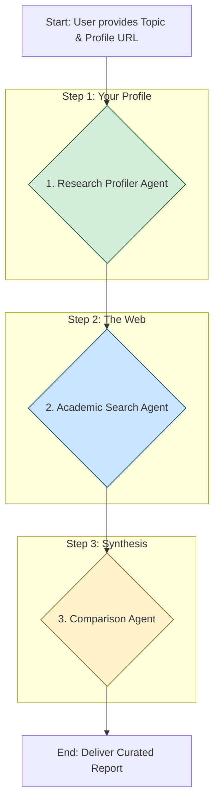

# Academic Research Assistant Agent

## Overview

The Academic Research Assistant is an AI-powered agent designed to automate and accelerate the literature review process for researchers, PhD students, and R&D professionals. By analyzing a researcher's existing body of work, it intelligently searches for the latest, most relevant publications in their field and delivers a curated, annotated bibliography highlighting key connections and insights.

This agent helps you stay on top of your field, discover novel research paths, and save countless hours of manual work.

## Features

*   **Personalized Discovery**: Finds papers relevant to *your* specific research history and interests.
*   **Automated Profiling**: Extracts key concepts and methodologies from your public researcher profile (e.g., Google Scholar).
*   **Targeted Academic Search**: Scans scholarly databases like Google Scholar, arXiv, and PubMed for recent and relevant articles.
*   **Insightful Analysis**: Identifies thematic links, new methodologies, and findings that support or contradict your work.
*   **Actionable Reports**: Delivers a clean, annotated list of papers with notes explaining their relevance.

## How It Works

The agent operates using a three-step, multi-agent workflow orchestrated by a central root agent:



1.  **Profiler Agent**: Scrapes your public profile to understand your research footprint.
2.  **Search Agent**: Uses your profile keywords and the stated topic to find new papers.
3.  **Comparison Agent**: Synthesizes the results, comparing the new papers to your existing work to generate insights.

## Getting Started

### Prerequisites

*   Python 3.9+
*   Google AI Development Kit (`pip install google-adk`)
*   Access to a Gemini-powered model via API key.

### Configuration

1.  **Clone the repository**:
    ```bash
    git clone https://github.com/your-repo/awesome-adk-agents.git
    cd awesome-adk-agents/my-adk-agents/academic-research-assistant
    ```
2.  **Set up your environment**: Create a `.env` file in this directory and add your API key:
    ```
    GEMINI_API_KEY="YOUR_API_KEY_HERE"
    ```

### Running the Agent

You can interact with the agent using the ADK command-line interface:

```bash
adk run
```

The agent will then greet you and ask for your research topic and profile URL to begin the process.

## Customization

This agent is built for flexibility. You can customize its behavior by modifying the prompts and tools:

*   **Prompts**: All agent instructions are defined in `academic_research_assistant/prompts.py`. You can edit these to change the agent's tone, the structure of its final report, or the focus of its analysis.
*   **Tools**: The tools are located in `academic_research_assistant/tools/`. You could, for example, add a new tool to search a specific, private database or modify the `profile_scraper_tool` to work with different profile page layouts.

## Project Structure

```
academic-research-assistant/
│
├── academic_research_assistant/
│   ├── sub_agents/
│   │   ├── __init__.py
│   │   ├── comparison/
│   │   ├── profiler/
│   │   └── searcher/
│   ├── tools/
│   │   ├── __init__.py
│   │   └── profile_scraper.py
│   ├── __init__.py
│   ├── agent.py         # Main root agent definition
│   └── prompts.py       # All system prompts
│
├── .env.example       # Example environment file
├── PRD.md             # Product Requirements Document
└── README.md          # This file
``` 